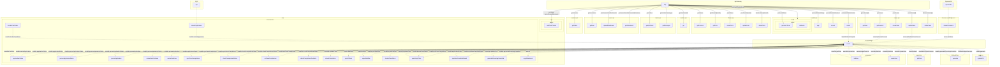

# Lambda

```mermaid
flowchart
    direction TB
    subgraph ApiGateway
        http
    end

    subgraph EventBridge
        events
    end

    subgraph DynamoDB
        dynamodb
    end

    subgraph SQS
        sqs
    end

    subgraph auth
        subgraph token
            http -->|"post:auth/token"| generateToken
            authorize
        end
    end

    subgraph bankid-api
        http -->|"post:auth/bankid/auth"| auth
        http -->|"post:auth/bankid/sign"| sign
        http -->|"post:auth/bankid/collect"| collect
        http -->|"post:auth/bankid/cancel"| cancel
        collect .->|"BankIdCollectComplete"| events
    end

    subgraph case-ms
        events .->|"pdfMs.generate"| updatePdf
    end

    subgraph cases-api
        http -->|"get:/cases/{id}"| getCase
        http -->|"get:/cases"| getCaseList
        http -->|"post:/cases"| createCase
        http -->|"put:/cases/{id}"| updateCase
        http -->|"delete:/cases/{id}"| deleteCase

        getCaseList .->|"casesApiInvokeSuccess"| events
        updateCase .->|"casesApiUpdateCaseSuccess"| events
    end

    subgraph forms-api
        http -->|"get:/forms"| getFormList
        http -->|"get:/forms/{formId}"| getForm
        http -->|"post:/forms"| createForm
        http -->|"put:/forms/{formId}"| updateForm
        http -->|"delete:/forms/{formId}"| deleteForm
    end

    subgraph html-pdf-ms
        events .->|"vivaMs.generateRecurringCaseHtml"| generate
        generate .->|"PdfMsGenerateSuccess"| events
    end

    subgraph metrics-api
        http -->|"get:/metrics/ekb"| get
    end

    subgraph navet-ms
        events .->|"bankId.collect"| pollUser

        pollUser .->|"navetMsPollUserSuccess"| events
    end

    subgraph status-api
        http -->|"get:/status"| getApiStatus
        http -->|"get:/status/messages"| getMessages
    end

    subgraph stream-eventbridge-ms
        dynamodb .-> streamProcessor
        streamProcessor .->|"cases.database"| events
    end

    subgraph users-api
        http -->|"get:/users/me"| getUser
        http -->|"post:/users/me/attachments"| uploadAttachment
        http -->|"get:/users/me/attachments/{filename}"| getAttachment
    end

    subgraph users-ms
        events .->|"navetMs.pollUser"| findUser
        events .->|"usersMs.createUser"| findUser
        events .->|"casesApi.getCaseList"| findUser
        events .->|"usersMs.findUser"| createUser

        createUser .->|"usersMs.createUser"| events
        findUser .->|"usersMs.findUser"| events
    end

    subgraph version-api
        http -->|"get:/version"| getStatus
    end

    subgraph viva
        subgraph api
            subgraph cases
                http -->|"put:/viva-cases/{caseId}/persons"| addCasePerson
            end
        end
        subgraph microservice
            events .->|"usersMs.findUser"| applicationStatus
            events .->|"vivaMs.submitApplication"| applicationStatus
            events .->|"vivaMs.applicationStatus"| personApplicationStatus
            events .->|"vivaMs.personApplicationStatus"| personApplication
            events .->|"vivaMs.personApplicationStatus"| createNewVivaCase
            events .->|"vivaMs.personApplication"| createVivaCase
            sqs .-> submitApplication
            events .->|"vivaMs.applicationStatus"| syncCaseCompletions
            events .->|"vivaMs.syncCaseCompletions"| checkCompletionsStatus
            events .->|"vivaMs.checkCompletionsStatus"| setCaseCompletions
            events .->|"vivaMs.checkCompletionsStatus"| checkCompletionsDueDate
            events .->|"casesApi.updateCase"| submitCompletion
            events .->|"cases.database"| syncOfficers
            events .->|"bankId.collect"| syncWorkflow
            events .->|"vivaMs.syncWorkflow"| decideCaseStatus
            events .->|"casesApi.updateCase"| syncExpiryTime
            events .->|"vivaMs.decideCaseStatus"| syncExpiryTime
            events .->|"vivaMs.setCaseCompletions"| syncExpiryTime
            events .->|"vivaMs.applicationStatus"| syncNewCaseWorkflowId
            events .->|"casesApi.updateCase"| generateRecurringCaseHtml
            events .->|"aws.s3"| copyAttachment

            applicationStatus .->|"vivaMs.applicationStatus"| events
            checkCompletionsStatus .->|"vivaMs.checkCompletionsStatus"| events
            decideCastStatus .->|"vivaMs.decideCaseStatus"| events
            generateRecurringCaseHtml .->|"vivaMs.generateRecurringCaseHtml"| events
            personApplication .->|"vivaMs.personApplication"| events
            personApplicationStatus .->|"vivaMs.personApplicationStatus"| events
            personApplicationStatus .->|"vivaMs.personApplicationStatus"| events
            setCaseCompletions .->|"vivaMs.setCaseCompletions"| events
            submitApplication .->|"vivaMs.submitApplication"| events
            syncCaseCompletions .->|"vivaMs.syncCaseCompletions"| events
            syncNewCaseWorkflowId .->|"vivaMs.syncNewCaseWorkflowId"| events
            syncWorkflow .->|"vivaMs.syncWorkflow"| events
        end
    end
```
