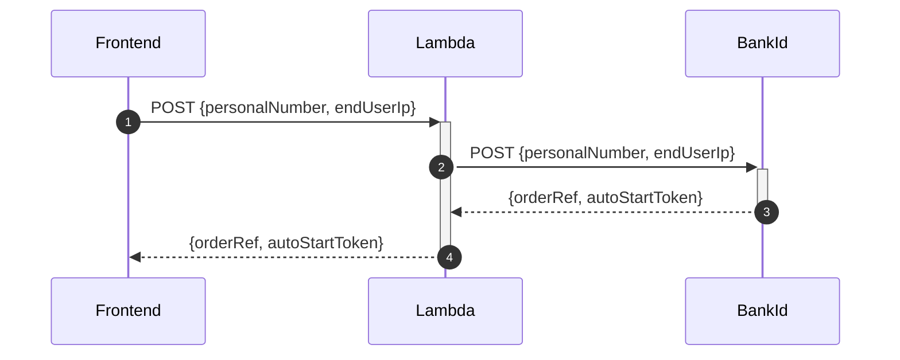
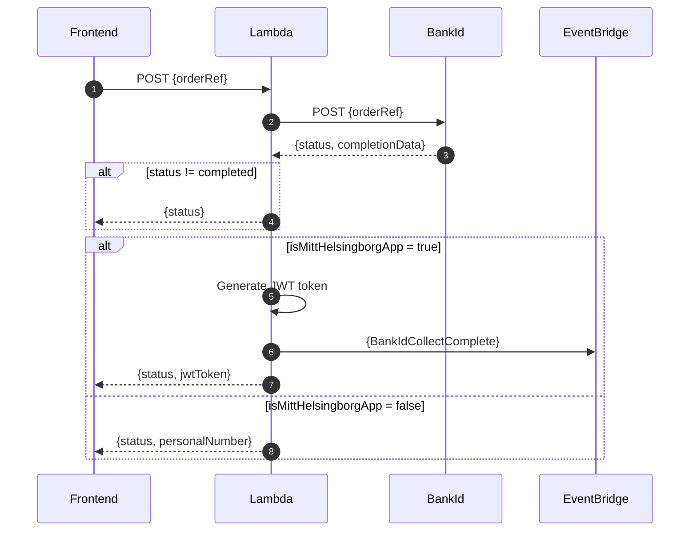
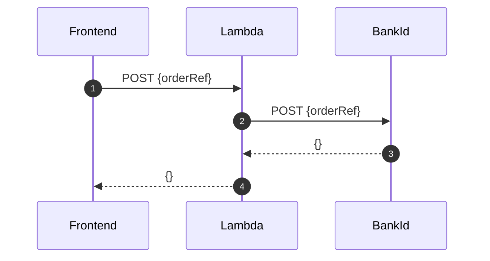
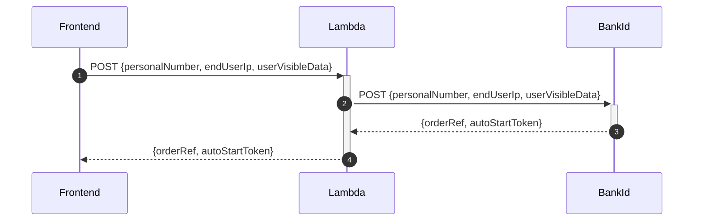

# HELSINGBORG IO SLS BANKID SERVICE

## Purpose

The BankID Service purpose is to provide integration towards the [Swedish BankID](https://www.bankid.com/) api.

## Description

The Bankid Service is a RESTful API that allows you use the following bankid integrations: authentication, sign, collect and cancel.

Complete documentation [BankID relying party guidelines (documentation)](https://www.bankid.com/bankid-i-dina-tjanster/rp-info).

The workflow to perform a login is as follows: you make an authentication request, and then start periodically polling against the collect end-point. This continues until the session expires, or the user cancels, or the user successfully logs in, in which case we receive a success response.

## Getting started

1. Read the global requierments for this repo, can be found [here](https://github.com/helsingborg-stad/helsingborg-io-sls-api/blob/dev/README.md)
2. Create a S3 Bucket and upload bankd-id certificates - two files .ca and .pfx. Remember the bucket name for reference at step 3.
3. Setup environment variables (aka. AWS System Manage - Parameter Store)

```json
{
  "apiUrl": "[BankID root url]",
  "passphrase": "[BankID passphrase]",
  "bucketName": "[AWS S3 bucket name]",
  "caName": "[some.ca file]",
  "pfxName": "[some.pfx file]"
}
```

### AWS Api Gateway

A running instance of a Api Gateway on AWS that includes a gateway resource named /auth. You can find and deploy this in our [resource](https://github.com/helsingborg-stad/helsingborg-io-sls-resources/tree/dev/services/gateway/resources/auth) repository.

### AWS System Manager - Paramter Store

This can be created by the resources repo. You can find and deploy this in our [resource](https://github.com/helsingborg-stad/helsingborg-io-sls-resources/tree/dev/services/parameterStore) repository.

### Installation

```bash
yarn install
```

### Deploy and run on AWS

```bash
sls deploy --verbose
```

When you deploy the service, serverless will output the generated url in the terminal that the service can be accessed from.

## BankID API

### AUTH



#### Request type

`POST`

#### Endpoint

`/bankid/auth`

#### JSON payload

```json
{
  "personalNumber": "203010101010",
  "endUserIp": "0.0.0.0"
}
```

#### Excpected response

```json
{
  "jsonapi": {
    "version": "1.0"
  },
  "data": {
    "type": "bankIdAuth",
    "attributes": {
      "orderRef": "order-reference-id",
      "autoStartToken": "auto-start-token",
      "qrStartToken": "qr-start-token",
      "qrStartSecret": "qr-start-secret"
    }
  }
}
```

---

### COLLECT



#### Request type

`POST`

#### Endpoint

`/bankid/collect`

#### JSON payload

```json
{
  "orderRef": "order-reference-id"
}
```

#### Expected response

Pending

```json
{
  "jsonapi": {
    "version": "1.0"
  },
  "data": {
    "type": "bankIdCollect",
    "attributes": {
      "orderRef": "order-reference-id",
      "status": "pending",
      "hintCode": "noClient"
    }
  }
}
```

Completed auth (Mitt Helsingborg App)

See - authorizationCode

```json
{
  "jsonapi": {
    "version": "1.0"
  },
  "data": {
    "authorizationCode": "some-token",
    "orderRef": "some-ref",
    "status": "complete",
    "completionData": {
      "user": {
        "personalNumber": "190000000000",
        "name": "Karl Karlsson",
        "givenName": "Karl",
        "surname": "Karlsson"
      },
      "device": {
        "ipAddress": "192.168.0.1"
      },
      "cert": {
        "notBefore": "1502983274000",
        "notAfter": "1563549674000"
      },
      "signature": "<base64-encoded>",
      "ocspResponse": "<base64-encoded>"
    }
  }
}
```

Completed auth (Default)

authorizationCode is left out

```json
{
  "jsonapi": {
    "version": "1.0"
  },
  "data": {
    "orderRef": "some-ref",
    "status": "complete",
    "completionData": {
      "user": {
        "personalNumber": "190000000000",
        "name": "Karl Karlsson",
        "givenName": "Karl",
        "surname": "Karlsson"
      },
      "device": {
        "ipAddress": "192.168.0.1"
      },
      "cert": {
        "notBefore": "1502983274000",
        "notAfter": "1563549674000"
      },
      "signature": "<base64-encoded>",
      "ocspResponse": "<base64-encoded>"
    }
  }
}
```

---

### CANCEL



#### Request type

`POST`

#### Endpoint

`/bankid/cancel`

#### JSON payload

```json
{
  "orderRef": "order-reference-id"
}
```

#### Expected response

```json
{
  "jsonapi": {
    "version": "1.0"
  },
  "data": {
    "type": "bankidCancel",
    "id": "order-reference-id",
    "attributes": {
      "message": "cancelled"
    }
  }
}
```

---

### SIGN



#### Request type

`POST`

#### Endpoint

`/bankid/sign`

#### JSON payload

```json
{
  "personalNumber": "190101010101",
  "endUserIp": "0.0.0.0",
  "userVisibleData": "example-message"
}
```

#### Expected response

```json
{
  "jsonapi": {
    "version": "1.0"
  },
  "data": {
    "type": "bankIdSign",
    "attributes": {
      "orderRef": "order-reference-id",
      "autoStartToken": "auto-start-token",
      "qrStartToken": "qr-start-token",
      "qrStartSecret": "qr-start-secret"
    }
  }
}
```
