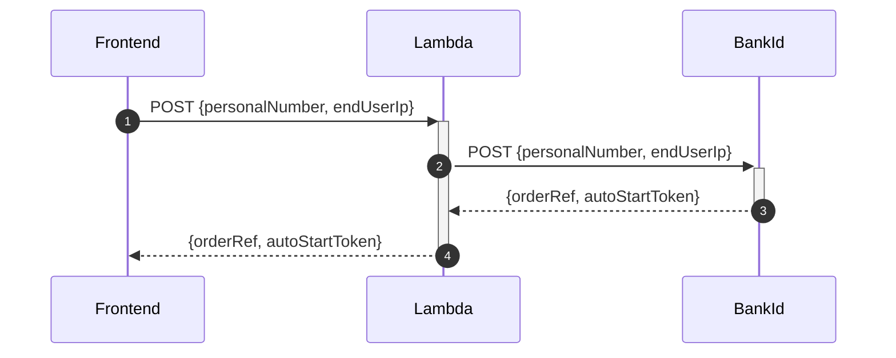
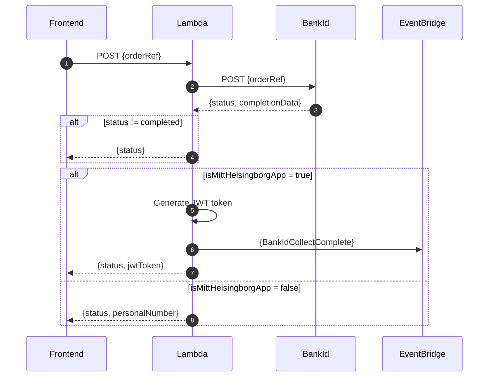
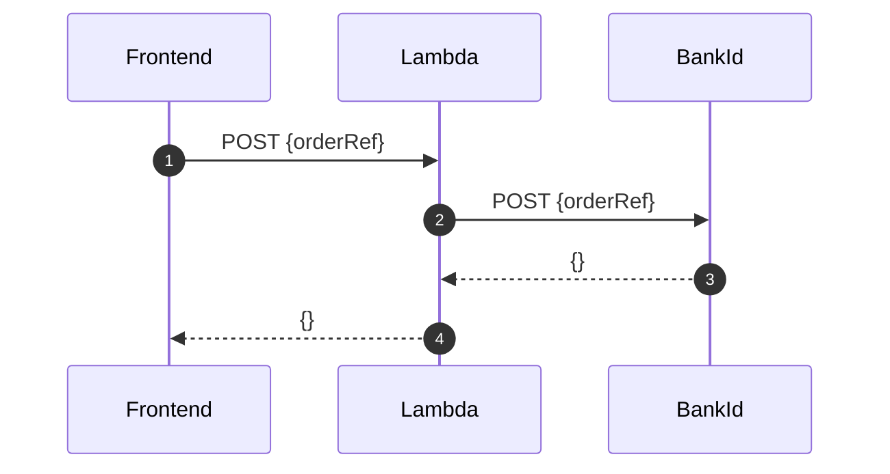
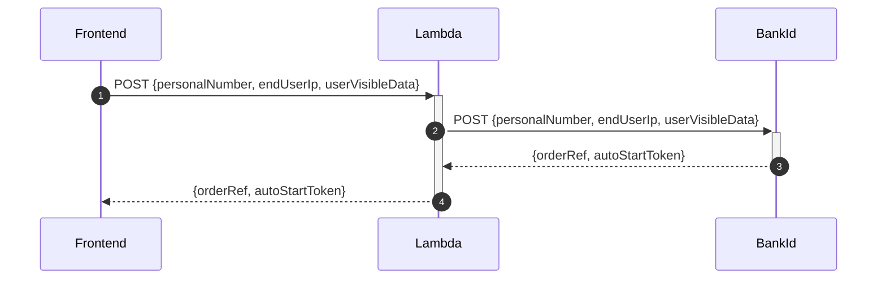

# HELSINGBORG IO SLS BANKID SERVICE

## Purpose

The BankID Service purpose is to provide integration towards [the swedish bankid](https://www.bankid.com/) api.

## Description

The Bankid Service is a RESTful API that allows you use the following bankid integrations: authentication, sign, collect and cancel.

Complete documentation [Bank ID relying party guidelines (documentation)](https://www.bankid.com/bankid-i-dina-tjanster/rp-info).

The workflow to perform a login is as follows: you make an authentication request, and then start periodically polling against the collect end-point. This continues until the session expires, or the user cancels, or the user successfully logs in, in which case we receive a success response.

## Getting started

1. Read the global requierments for this repo, can be found [here](https://github.com/helsingborg-stad/helsingborg-io-sls-api/blob/dev/README.md)

2. Create a S3 Bucket and upload bankd-id certificates - two files .ca and .pfx. Save the bucket name for reference in step 3.

3. Setup env variables (aka. AWS PARAMETERSTORE)

```
{
    "apiUrl": "https://something/rp/v5", //BankId Root URL
    "passphrase": "yourPassPhrase", //Bankid Passphrase
    "bucketName": "example-bucketname-1i52eggtf17ir", //Bucket name reference
    "caName": "bankid.ca",  //Filename of your .ca file
    "pfxName": "FPTestcert2.pfx" //Filename of your .pfx file
}
```

### AWS API GATEWAY

A running instance of a API GATEWAY on AWS that includes a gateway resource named /auth. You can find and deploy this in our [resource](https://github.com/helsingborg-stad/helsingborg-io-sls-resources/tree/dev/services/gateway/resources/auth) repository.

### AWS PARAMETERSTORE

A setup of AWS paramterstore on aws. This can be created from the resource api. You can find and deploy this in our [resource](https://github.com/helsingborg-stad/helsingborg-io-sls-resources/tree/dev/services/parameterStore) repository.

### Installation

```bash
$ npm install
```

### Run Local

```bash
$ sls offline
```

When you deploy the service, serverless will output the generated url in the terminal that the service can be accessed from.

### Deploy and Run on AWS

Deploy command:

```bash
$ sls deploy -v
```

When you deploy the service, serverless will output the generated url in the terminal that the service can be accessed from.

## API

### BANKID AUTH



#### Endpoint

`/bankid/auth`

#### JSON PAYLOAD

```
  {
    "personalNumber": "203010101010",
    "endUserIp": "0.0.0.0"
  }
```

#### Excpected Response

```
{
  "jsonapi": {
    "version": "1.0"
  },
  "data": {
    "type": "bankIdAuth",
    "attributes": {
      "orderRef": "a-order-ref-id",
      "autoStartToken": "a-auto-start-token"
    }
  }
}
```

### BANKID COLLECT



#### Endpoint

`/bankid/collect`

#### JSON Payload

```
{
	"orderRef": "a-order-ref-id"
}
```

#### Expected JSON Response

While pending:

```
{
  "jsonapi": {
    "version": "1.0"
  },
  "data": {
    "type": "bankIdCollect",
    "attributes": {
      "orderRef": "a-order-ref-id",
      "status": "pending",
      "hintCode": "noClient"
    }
  }
}
```

After completed login:

```
{
  "jsonapi": {
    "version": "1.0"
  },
  "data": {
    "orderRef":"131daac9-16c6-4618-beb0-365768f37288",
    "status":"complete",
    "completionData":{
      "user":{
        "personalNumber":"190000000000",
        "name":"Karl Karlsson",
        "givenName":"Karl",
        "surname":"Karlsson"
      },
      "device":{
        "ipAddress":"192.168.0.1"
      },
      "cert":{
        "notBefore":"1502983274000",
        "notAfter":"1563549674000"
      },
      "signature":"<base64-encoded data>",
      "ocspResponse":"<base64-encoded data>"
    }
  }
}
```

### BANKID CANCEL



#### Endpoint

`/bankid/cancel`

#### JSON Payload

```
{
	"orderRef": "a-order-ref-id"
}
```

#### Expected JSON Response

```
{
  "jsonapi": {
    "version": "1.0"
  },
  "data": {
    "type": "bankidCancel",
    "id": "a-order-ref-id",
    "attributes": {
      "message": "cancelled",
    }
  }
}
```

### BANKID SIGN



#### Endpoint

`/bankid/sign`

#### JSON Payload

```
{
	"personalNumber": "190101010101",
	"endUserIp": "0.0.0.0",
	"userVisibleData": "example-message"
}
```

#### Expected JSON Response

```
{
  "jsonapi": {
    "version": "1.0"
  },
  "data": {
    "type": "bankIdSign",
    "attributes": {
      "orderRef": "a-order-ref-id",
      "autoStartToken": "an-auto-start-token"
    }
  }
}
```
