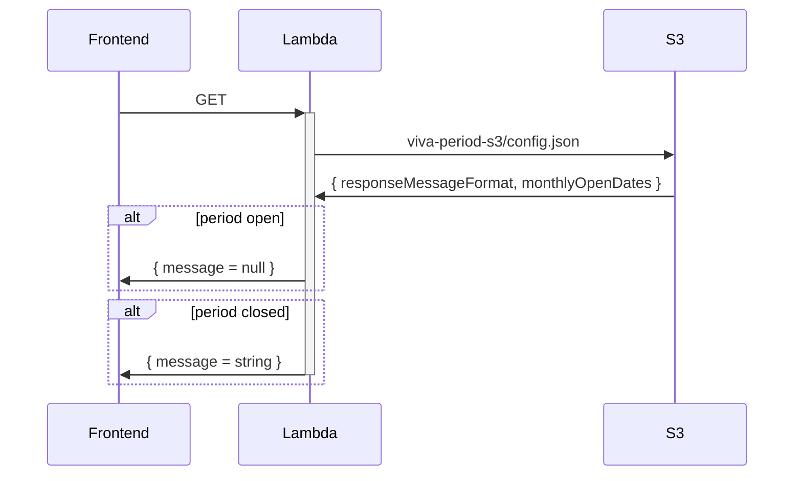

# HELSINGBORG IO SLS VIVA-PERIOD SERVICE

- [HELSINGBORG IO SLS VIVA-PERIOD SERVICE](#helsingborg-io-sls-viva-period-service)
  - [Description](#description)
  - [Getting Started](#getting-started)
    - [Example Config](#example-config)
  - [Endpoints](#endpoints)
    - [Status](#status)

## Description

The VIVA-Period API provides functionality for discovering information about an active VIVA Period.

## Getting Started

1. Read the global requirements for this repo which can be found [here](../../../../README.md).
2. In your `viva-period-s3` bucket (should be created when deploying [Resources](https://github.com/helsingborg-stad/helsingborg-io-sls-resources)) add a `config.json` file (see **Example Config** below).

### Example Config

```json
{
  "responseMessageFormat": "Ansökan för {{ nextMonth }} öppnar {{ openDate }}",
  "monthlyOpenDates": [
    "2023-01-05T08:00:00Z",
    "2023-02-05T08:00:00Z",
    "2023-03-05T08:00:00Z",
    "2023-04-05T08:00:00Z",
    "2023-05-05T08:00:00Z",
    "2023-06-05T08:00:00Z",
    "2023-07-05T08:00:00Z",
    "2023-08-05T08:00:00Z",
    "2023-09-05T08:00:00Z",
    "2023-10-05T08:00:00Z",
    "2023-11-05T08:00:00Z",
    "2023-12-05T08:00:00Z"
  ]
}
```

## Endpoints

### Status

**Request Type**: `GET`

**Request Endpoint**: `/viva/period/status`

This endpoint returns checks if the period is open for the calling user.

If the period is closed a message is returned with details of when the period opens.

If the period is open then `null` is returned as message instead.


