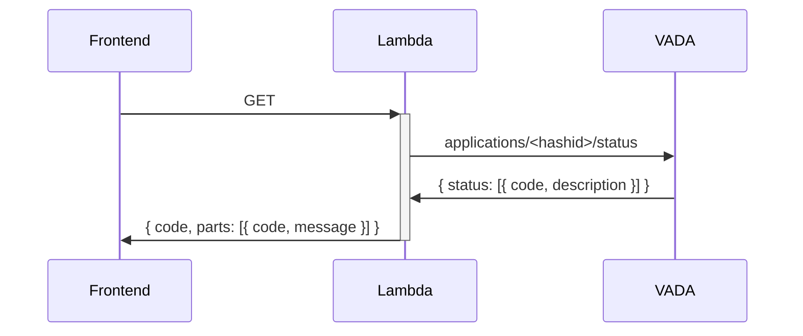

# HELSINGBORG IO SLS VIVA-STATUS SERVICE

- [HELSINGBORG IO SLS VIVA-STATUS SERVICE](#helsingborg-io-sls-viva-status-service)
  - [Description](#description)
  - [Getting Started](#getting-started)
  - [Endpoints](#endpoints)
    - [Status](#status)

## Description

The VIVA-Status API provides functionality for fetching information about a person's VIVA status and status codes.

The VIVA status code(s) indicate which state the person is in according to VIVA and can be useful for determining
available actions and for debugging.

## Getting Started

1. Read the global requirements for this repo which can be found [here](../../../../README.md).

## Endpoints

### Status

**Request Type**: `GET`

**Request Endpoint**: `/viva-status`

**Security**: Bearer Token

This endpoints returns the full code as well as a list of parts with their separate code and a descriptive message.

