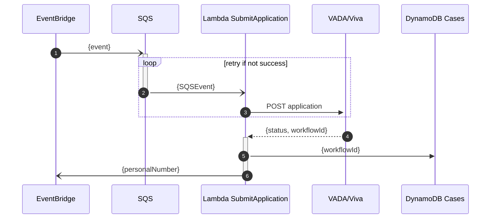
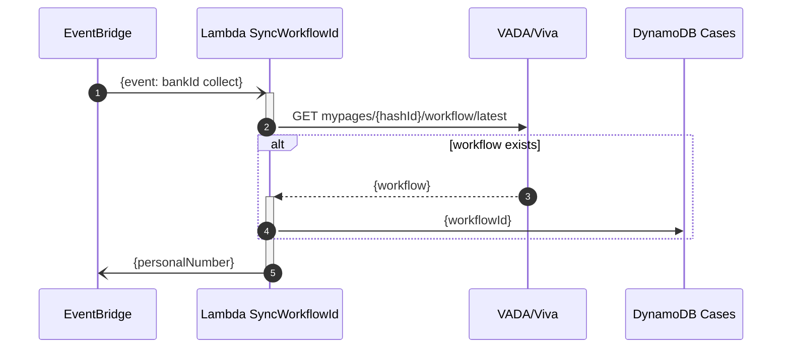

# HELSINGBORG IO SLS VIVA MICROSERVICE

## Purpose

The purpose of the Viva Microserivce is to provide the data flow between AWS and the Viva api adapter - VADA.

## Requirements

Read the global requirements for this repo, can be found [here](https://github.com/helsingborg-stad/helsingborg-io-sls-api/blob/dev/README.md)

### Installation Viva Microservice

```bash
cd microservice
yarn install
```

### Installation Viva Api

```bash
cd api/cases
yarn install
```

### Deploy and run on AWS

Deploy command:

```bash
sls deploy
```

## Viva Api

#### Request type

`POST`

#### Endpoint

`/viva-cases/{caseId}/persons`

#### JSON payload

```json
{
  "personalNumber": "203010101010"
}
```

#### Excpected response

```json
{
  "jsonapi": {
    "version": "1.0"
  },
  "data": {
    "type": "viva-cases",
    "attributes": "[case]"
  }
}
```

---

## Viva submit application sequence diagram



---

## Sync case with latest workflow id (new application)


